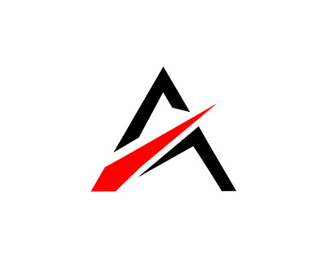
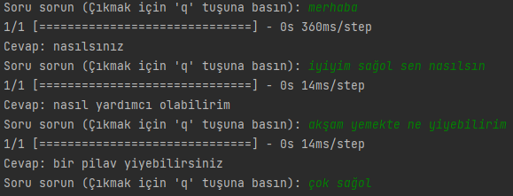

# Asena Sohbet Yapay Zekası Hakkında
<p align="center">
  
</p>

Bu projede, TensorFlow ve SQLAlchemy kullanılarak bir metin tabanlı konuşma modeli oluşturulmuştur. Bu model, kullanıcının sorularına metin tabanlı cevaplar vermek için kullanılabilir. Aşağıda, bu projeyi kullanmak için adım adım talimatlar bulunmaktadır.

## Gereksinimler

Bu kodun doğru çalışabilmesi için aşağıdaki gereksinimlere ihtiyacınız vardır:

- Python (3.x sürümü önerilir)
- TensorFlow (2.x sürümü önerilir)
- SQLAlchemy
- SQLite veritabanı
- Dicle'ye tapmak.

Projeyi çalıştırmadan önce bu gereksinimleri kurduğunuzdan emin olun.

## Kullanım

1. **Proje Dosyalarını İndirin veya Klonlayın**

   Proje dosyalarını indirin veya klonlayın:

   ```shell
   git clone https://github.com/batiozdmr/asena.git
   ```

2. **Veritabanı Oluşturma**

- SQLite veritabanı kullanılıyor. `konusma_veritabani.db` adında bir SQLite veritabanı oluşturun veya mevcut bir veritabanını kullanın.

3. **Veritabanı Şemasını Tanımlama**

- Veritabanı şeması SQLAlchemy ile tanımlanmıştır ve `SorularCevaplar` adında bir tablo içerir. Bu tablo, kullanıcı girdilerini ve model cevaplarını saklar.

4. **Modeli Eğitme**

- Proje kodunu çalıştırarak modelinizi eğitebilirsiniz. Bu kod, veritabanındaki soru ve cevapları kullanarak bir metin işleme modeli oluşturur.

5. **Soru Sorma ve Cevap Alma**

- Model eğitildikten sonra, kod bir döngü içinde çalışır ve kullanıcının sorularına yanıtlar verir. Bir soru sormak için basitçe bir soru girin ve model cevabını alın.

6. **Çıkış**

- Soru sormayı bırakmak istediğinizde, "q" tuşuna basarak döngüyü sonlandırabilirsiniz.

## Örnek Kullanım

- Model eğitildikten sonra, örnek bir kullanım aşağıdaki gibidir:
  
  

# Katkı Sağlama Kılavuzu

Teşekkür ederiz ki projeme katkıda bulunmayı düşünüyorsunuz! Katkılarınız, projemizin gelişmesine yardımcı olacaktır.

## Katkıda Bulunmaya Başlama

1. Projeyi çılgınca çatallayın (fork) ve yerel bir kopya oluşturun.
2. Yerel klonunuzu kurun ve projeyi çalıştırın.
3. Değişikliklerinizi yapın ve yerel klonunuzda test edin.
4. Değişikliklerinizi yerel klonunuzda tamamladıktan sonra, bu değişiklikleri çılgınca çatalınızda (fork) saklayın.
5. GitHub üzerinden bir birleştirme isteği (pull request) açın.

## Birleştirme İsteği (Pull Request)

- Birleştirme isteği açarken, yaptığınız değişiklikleri açık ve anlaşılır bir şekilde açıklayın.
- Birleştirme isteğinizle ilişkilendirmek için uygun etiketleri (labels) ekleyin.
- Değişikliklerinizin geçerli olduğundan emin olmak için testler ekleyin ve mevcut testleri geçtiğinden emin olun.

## İletişim

Soru veya önerileriniz varsa, lütfen [ozdemirbatihan@gmail.com](mailto:ozdemirbatihan@gmail.com) adresi üzerinden benimle iletişime geçin.

## Lisans

Bu proje [MIT Lisansı](LICENSE) ile lisanslanmıştır. Katkı sağlamadan önce lütfen lisansı okuyun.


